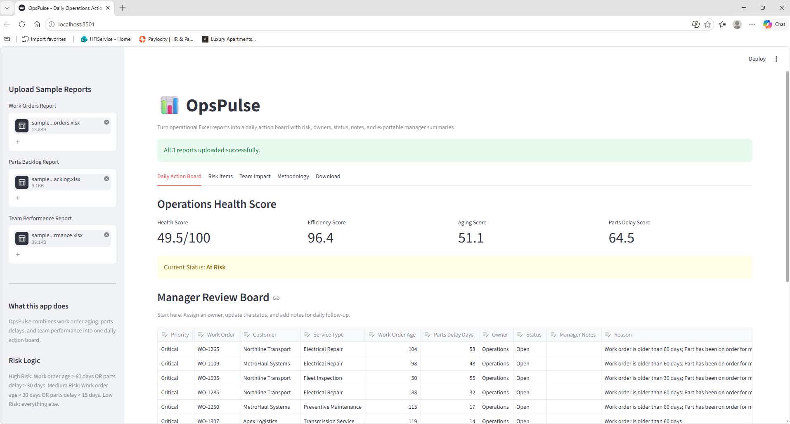
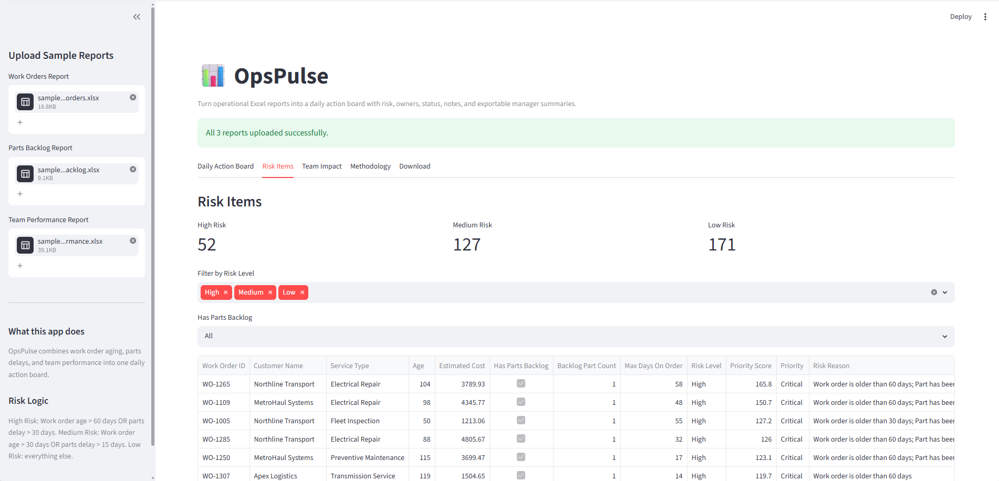
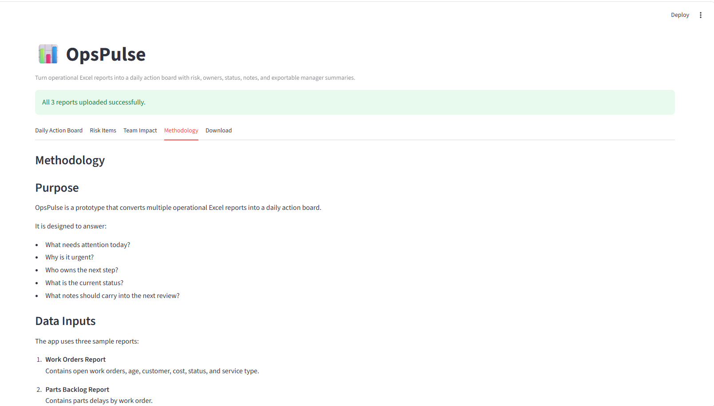

# OpsPulse: Daily Operations Action Board

OpsPulse is a Streamlit-based operations analytics prototype that converts multiple Excel reports into a daily action board.

The goal of this project is to move beyond static reporting and help teams quickly understand what needs attention, why it matters, who owns the next step, and what action should be taken.

## Business Problem

Many operations teams still rely on separate Excel reports to review daily work. These reports may contain useful data, but the information is often spread across different files, making it harder for managers to quickly identify priorities.

Common questions include:

- Which work orders need attention today?
- Which items are aging or delayed?
- Are any parts delays creating operational risk?
- Who should follow up?
- What is the current status?
- What notes should be carried into the next review?

OpsPulse brings these questions into one action-oriented view.

## Solution

The app combines three sample operational reports:

1. **Work Orders Report**
   - Work order ID
   - Customer
   - Open date
   - Work order age
   - Estimated cost
   - Status
   - Service type

2. **Parts Backlog Report**
   - Work order ID
   - Part number
   - Part description
   - Days on order
   - Vendor
   - ETA status

3. **Team Performance Report**
   - Technician
   - Work order ID
   - Job date
   - Worked hours
   - Billed hours
   - Efficiency

The app then generates a manager-ready action board with risk levels, reasons, recommended actions, owner, status, notes, and an exportable Excel report.

## Key Features

- Upload multiple Excel reports
- Calculate work order risk levels
- Identify aging work orders
- Identify delayed parts
- Generate an operations health score
- Create a manager review board
- Assign owner and status
- Add manager notes
- View team impact
- Export a manager-friendly Excel report
- Uses synthetic sample data only

## Risk Logic

Risk level is calculated using work order aging and parts delay.

### High Risk

A work order is marked as high risk if:

- Work order age is greater than 60 days, or
- Parts delay is greater than 30 days

### Medium Risk

A work order is marked as medium risk if:

- Work order age is greater than 30 days, or
- Parts delay is greater than 15 days

### Low Risk

Everything else is marked as low risk.

## Health Score

The operations health score is a prototype score from 0 to 100.

It combines:

- Team efficiency
- Work order aging
- Parts delay
- High-risk item penalty

A higher score means the operation is in a healthier state. A lower score means more items need attention.

## Tech Stack

- Python
- Pandas
- Streamlit
- OpenPyXL
- Faker
- Excel

## Project Structure

```text
OpsPulse/
│
├── app.py
├── generate_sample_data.py
├── requirements.txt
├── README.md
├── .gitignore
│
├── sample_data/
│   ├── sample_work_orders.xlsx
│   ├── sample_parts_backlog.xlsx
│   └── sample_team_performance.xlsx
│
├── screenshots/
│   ├── daily_action_board.png
│   ├── risk_items.png
│   └── methodology.png
│
└── src/

```
## How to Run Locally

### 1. Open the project folder

```bash
cd OpsPulse
```

### 2. Create a virtual environment

```bash
python -m venv venv
```

### 3. Activate the virtual environment

On Windows:

```bash
venv\Scripts\activate
```

### 4. Install dependencies

```bash
pip install -r requirements.txt
```

### 5. Generate sample data

```bash
python generate_sample_data.py
```

### 6. Run the Streamlit app

```bash
streamlit run app.py
```

## Sample Data

This project uses synthetic sample data generated with Python and Faker.

No confidential, customer, company, or real operational data is included.

## Screenshots

### Daily Action Board



### Risk Items



### Methodology



## Future Improvements

Potential improvements include:

- Add charts for aging and backlog trends
- Add historical trend tracking
- Add SLA thresholds by service type
- Add automated recommendations by risk category
- Add database storage for manager notes and status updates
- Add user authentication
- Deploy as a web app

## Disclaimer

This is a portfolio prototype built with synthetic data for demonstration purposes. The scoring logic is rule-based and can be adjusted depending on business needs.